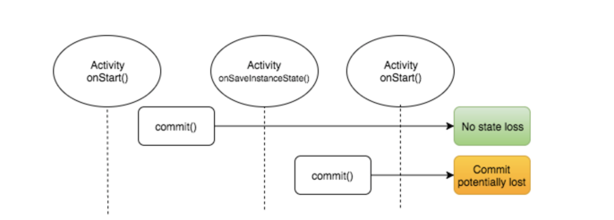

## 空指针篇

1. 【建议】字符串比较，将常量放在前面

case:
```java
static final String DOMESTIC = "1"
domestic.equals(DOMESTIC);
```

修正为：
```java
DOMESTIC.equals(domestic);
```

> 页面间对象传参在数据不完整的情况下崩溃，多数情况下是因为接收到了空的传参未处理直接调用，建议不要依赖调用方的"安全"使用。


2. 返回空列表替代null

```java
List<Product> getAllLocale(){
     ...
      if(productList == null){
         return new ArrayList<Product>();
      }
}
```
> return参数在后续会被使用，如果难以保证调用的地方都安全的调用了，最好还是不要返回null。

3. 【建议】使用判空的工具类

```java 
//字符换判空
android.text.TextUtils.isEmpty()
 
//集合判空
CustomListUtil.hasItem()|isNullOrEmpty()
```

> 使用工具类的好处是，容易养成习惯并且避免取反等逻辑错写出现


4. 【重要】使用String.valueOf(Object) 替代 Object.toString()

```java
User user = ..;
 
Log.d("TAG",user.toString());
```

更改为：
```java
Log.d("TAG",String.valueOf(user))
```

5. 你的Deeplink/Router/CMPC每个参数都应该考虑空的情况

契约类型，传入的参数较为自由，组合也比较多。即使规范好了调用方式，也可能存在非法的传入。请考虑每个参数为空的情况。


6. 使用context和activity的引用时先判空

```java
Router.toLogin((Activity) view,
    new IRouterCallBack() {
        @Override
        public void onResult(String module, String page, Bundle bundle) {
            if (isLogin()) {
                setTitle("test")
     }
  }
}));
```

onResult回调时，view可能已经被回收了。

> activity被回收后调用容易引起内存泄漏，相对于找内存泄漏，空安全也可能让内存泄漏不Crash。

## 类型转换篇

1. 【建议】注意你的String转Number的方法

如：Double.valueOf(String),String.parseDouble(String) ，传入的类型如果不是数字格式的就会出错。做好合法性校验，甚至是trycatch。

正确如下：
```java
if (gatewayTime != null) {
try {
		double gatewayTimeDouble = Double.parseDouble(gatewayTime);
		serverCallParams.addCurrentServerCallExtraInfos("gatewayTime", gatewayTimeDouble * 1000);
	} catch (Throwable ignore) {
	}
}
```

2. 【重要】不要信任系统API返回的数据。转换操作一律trycatch.trycatch.

错误示例:
```java
//获取网络代理的状态
Integer.parseInt(System.getProperty("http.proxyPort"))
```
这里返回的不一定是数字，可能的原因是安卓碎片太严重，有些厂商上的api就说不定了。

3. 【重要】做好类型判断后再转换

```java
if (params instanceof CoordinatorLayout.LayoutParams) {
    ((CoordinatorLayout.LayoutParams) params).setBehavior(null);
}
```
> kotlin的话使用is关键字

## 线程安全篇

1.【重要】你的单例安全吗

```java
DBHelper instance = null;
 
public static DBHelper getDBHelper(Context context) {
    if (instance == null) {
        instance = new DBHelper()
    }
    return instance;
}
```

在多线程的情况下dbHelper == null就不是一定成立的了，这就可能导致创建了多个实例出来，违背了单例的本意。

> 这里可以voliate 你的dbHelper，让这个变量对其他的线程可见。或者同步整个获取单例的操作，但是在频繁调用的情况下注意性能开销。

线程安全单例示例：

```java
private static final Object mutex = new Object();
public static IBULocaleManager getInstance() {
    IBULocaleManager result = instance;
    if (result == null) {
        synchronized (mutex) {
            result = instance;
            if (result == null) {
                result = instance = new IBULocaleManager();
            }
        }
    }
    return result;
}
```
或

```java
private static final IBULocaleManager instance = new IBULocaleManager()
```

>在getInstance()比较频繁情况下，多数是命中非空直接实例的， 如果对整个getInstance方法加锁就会影响性能，这里只在为空需要初始化对象的时候同步和校验，大大降低了对性能的影响。

2. 【建议】隐藏你可以私有的方法和变量

如果你的方法不是一个线程安全的方法，且都是内部自己在调用（Java里面指在同一个类），请直接私有掉方法/变量，避免暴露出去让调用方引入了崩溃。

3. 【重要】发现死锁

- 当心嵌套锁，

如下：
```java 
private static Object lock1 = new Object();
private static Object lock2 = new Object();
 
private static class Task implements Runnable {
    @Override
    public void run() {
        synchronized (lock1) {
            synchronized (lock2) {
                try {
                    lock1.wait();
                } catch (InterruptedException e) {
                    e.printStackTrace();
                }
            }
        }
    }
}
```
- 获取锁设置超时

多数情况下ReentrantLock可以替换synchronized，获取锁时设置一个超时时间，降低死锁风险。
```java
 public void run() {
    try {
        if (lock1.tryLock(1, TimeUnit.SECONDS)) {}
    }
 }
 ```
  
- 正确释放锁
```java
try{
    do...
}catch(Exception ex){
    //lock.unlock() 不要在这里释放锁，try block里面可能也没有释放，而这里只处理异常的场景
}finally{
    //这里释放锁最佳
    lock.unlock()
}
```


4.【重要】集合遍历要当心

如果你没有选择线程安全的集合类（如CopyOnWriteArrayList)，那集合操作的地方都要当心了。

```java

List<String> list = ...
class RunableA implements Runable{
    void run(){
        list.remove(new Random().next(list.size));
    }
}

class RunableB implements Runable{
    void run(){
        for(String str:list{
            result = String.valueOf(str);
            ...
        }
    }
}
```

正确写法,操作集合的时候加同步：
```java

synchronized(list){
    list.remove(new Random().next(list.size));
}

synchronized(list){
    for(String str:list{
        result = String.valueOf(str);
        ...
    }
}
```
> 为了保证锁的正确性和不必要的性能开销，最好<b>集合对象来作为对象锁</b>，避免使用this这种对象锁，匿名内部类的话锁的就可能不是一个对象了，锁也是无效的。

5. 【重要】线程的取消和关闭

这是个容易被忽视但是很重要的一点，如果你的线程不能响应错误的中断或者在任务结束的时候没有正确的关闭它，那么他们一直运转下去，资源开销等也一直存在，间接引发其他问题。

- ExecuteService shutdown()

正确的stop
```java
 public void stop() throws InterruptedException {  
    try {  
        exec.shutdown(); 
        exec.awaitTermination(TIMEOUT, UNIT);  
    }  
}  
```
>需要区分shudown()和shutdownNow()的区别，如果你已经submit的task还想继续得到执行请不要使用和shutdownNow。

- "毒丸"/"标志位"中断

投放"毒丸"
```java
private volatile boolean canceled = false;
```

遇到毒丸放弃
```java
while(!canceled){
    doTask()
}
``` 
- Future cancle

```java
Future future = service.submit(new Task());
try {
   // 可能抛出异常
   future.get();
} catch (InterruptedException e) {
    e.printStackTrace();
} catch (ExecutionException e) {
    e.printStackTrace();
}finally {
    //终止任务的执行
    future.cancel(true);
}
```

## Android其他篇 

1、数据库的操作

- 确保操作的helper类是单例的并考虑了线程安全问题。
- 查询的时候尽量使用索引
- 避免DB过大，会引入较多的系统性问题

<br>
2. 【重要】混淆类问题

- 接入第三方库或者底层库的时候要阅读和关注混淆规则的接入
- 反射调用的类/方法检查不能混淆，引发导致classnotfound

<br>
3. 【建议】注意字符串拼接性能

避免大量字符串"+"的操作

```java
String str = "start";
for(int i =0 ;i < 100;i++){
    str = str + "trip";
}
```
> 建议使用StringBuiler/StringBuffer等完成

4. 【建议】注意字符串分隔性能

避免在会被频繁调用的方法中使用以下方式分隔字符串
```java
String str = "hello-world";
String[] results = str.split("-");
```
请使用性能更好的```indexOf()+substring(from+1, to)```组合

```java
String str = "hello-world";
int from = str.indexOf('-');
int to = str.indexOf('-', from+1);
String brown = str.substring(from+1, to);
```

5. 【重要】别在写内存泄漏了！

<b>HandlerLeak</b>

原因：Handler在Android中用于消息的发送与异步处理（MessageQueue)，常常在Activity中作为一个匿名内部类来定义，此时Handler会隐式地持有一个外部类对象（通常是一个Activity）的引用。当Activity已经被用户关闭时，内部的Handler还被MessageQueue保留着，Handler持有的Activity引用造成Activity无法被GC回收，这样容易造成内存泄露。

正确的做法是将其定义成一个静态内部类（此时不会持有外部类对象的引用），在构造方法中传入Activity并对Activity对象增加一个弱引用，这样Activity被用户关闭之后，即便异步消息还未处理完毕，Activity也能够被GC回收，从而避免了内存泄露。

风险代码：

```java
public class MyActivity extends AppCompatActivity{
    private Handler mHandler = new Handler() {
        @Override
        public void handleMessage(Message msg) {
        };
    };
}
```
正确案例:
```java
public static class MyHandler extends Handler {
    private WeakReference<Activity> reference;
 
    public MyHandler(Activity activity) {
        reference = new WeakReference<Activity>(activity);
    }
 
    @Override
    public void handleMessage(Message msg) {
        if (reference.get() != null) {
            switch (msg.what) {
            case 0:
            // do something...
            break;
            default:
            // do something...
            break;
            }
        }
    }
}
```
<b>StaticFieldLeak</b>
原因：静态对象/变量的生命周期是从第一次被JVM加载到内存一直到程序退出，其余的时间，垃圾回收机制都不会去回收它。

错误案例：单例中传入context/activity。导致context/acitivity没有办法及时回收、引起内存泄漏

```java
public class MapNavigationUtil {
       private static Context mContext;
       private static MapNavigationUtil instance = new MapNavigationUtil();
       private MapNavigationUtil() {}
       public static MapNavigationUtil getInstance(Context context) {
            mContext = context;
            return instance;
        }
}
```
正确写法:

```java
public class MapNavigationUtil {
       private static Context mContext;
       private static MapNavigationUtil instance = new MapNavigationUtil();
       private MapNavigationUtil() {}
       public static MapNavigationUtil getInstance(Context context) {
            mContext = context.getApplicationContext(); //使用applicationContext
            return instance;
        }
}
```
6. 【重要】正确使用@TargetApi注解
这个仅用于高版本编译兼容，不代表只会被高版本调用。

```java
@TargetApi(Build.VERSION_CODES.LOLLIPOP)
@Override
public void setupToolbar() {
    mRlToolbar.setElevation(ViewUtil.dp2px(getContext(), 2));
}
```
低于LOLLIPOP版本的也会调用次方法出现崩溃的情况，如果是为了区分不同版本的调用，使用Build变量做判断。

```java
if (Build.VERSION.SDK_INT >= Build.VERSION_CODES.LOLLIPOP) {
    setupToolbar();
}
```

7. 【重要】避免show dialog 出现BadTokenException

正确show的方式:
```java
if(getActivity()!=null && !isFinishing()) {
    alert.show();
}
```
Toast/DialogFragment/AlertDialog/Dialog的使用均要注意。

> 原因是activity可能已经被销毁了，上下文context也随之被销毁，这个时候再试图去show，就会出现Crash.

8. 【重要】异步show DialogFragment 使用 commitAllowingStateLoss代替show/commit方法

android 不允许在activity的onSaveInstanceState调用之后再改变状态，比如添加或移除fragment。如果系统在可能回收了activity之后仍然有异步的commit等操作，就会出现state loss的crash.

解决方案：

使用commitAllowingStateLoss()代替FragmentTransaction commit或show方法。

正确示例：
```java
@Override
public void showDialog(FragmentActivity context) {
if (context != null && !context.isFinishing()) {
       FragmentTransaction ft = context.getSupportFragmentManager().beginTransaction();
       ft.add(this, "PushAccessAuthDialog");
       ft.commitAllowingStateLoss();
   }
}
```

9. 【重要】Fragment commit vs commitAllowingStateLoss

添 加 Fragment 时，确保 FragmentTransaction#commit() 在Activity#onPostResume()或者 FragmentActivity#onResumeFragments()内调用。
不要随意使用 FragmentTransaction#commitAllowingStateLoss()来代替，任何commitAllowingStateLoss()的使用必须经过 code review，确保无负面影响。



