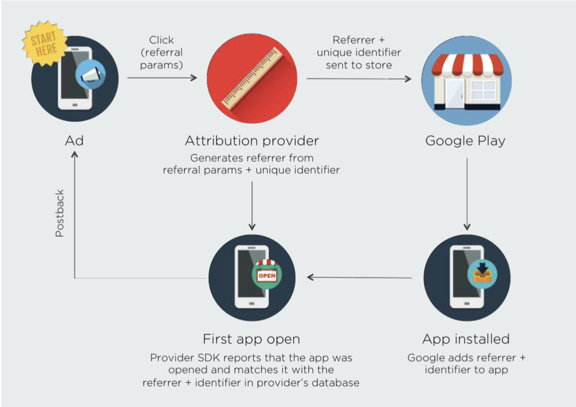

内容概念：

- 概念及分类
- 市场使用
- 唤起App机制
- 流转过程

<h1>App Link</h1>

通过一些技术手段有途径能唤起我们app的URI，我们统称为App Link

<h1>唤醒技术手段</h1>

- Uri Scheme（DeepLink）
- Universal Link（iOS）、App Links（Android）
- Deferred DeepLink

<h2>Uri Scheme</h2>

格式：customschema://host/path?params

<b>直接跳转</b>

- h5中模拟点击链接（Android）
- 设置window.location.href（iOS）

<b>iframe（iOS9之后不支持，chrome 25之后不支持）</b>

- 在body上添加iframe，设置src为跳转的Uri

<h2>Universal Link</h2>

<b>iOS Universal Links</b>

- 通过universal link唤起app，手机后右上角会有xxx.xx小箭头，用户点击之后系统会记住用户行为，universal link之后会不生效，需要重新提示用户触发universal link
- 必须跨域，不跨域不能跳转

<b>安卓6.0之后有app links，intent-filter中设置scheme、host、path</b>

<h2>Deferred DeepLink</h2>

Deferred DeepLink本质上的技术还是Deeplink技术，可以理解为一套可追踪的解决唤醒解决方案，一般由第三方实现如facebook、appflyer。

<b>Android</b>
- Google Play Referrer
- Google Advertising ID

<b> IOS </b>

- DFA
- Fingerprinting
- 模糊匹配（Device Name、Device Type、OS Version、IP...）

<b>Deferred Link原理</b>

以Referrer为例，如下图
其他方式Android/IOS区别在于First open判断的数据不一样。

<h1>App Link优化</h1>

- 浏览不间断性、流畅性(h5浏览；h5->app浏览)。
- Link投放前即通过有效性验证。
- 记录跟踪唤起->解析->跳转->落地页流程。
- Link解析跟踪。
- 跳转流程跟踪（Router）。
- 落地页内容有效性跟踪。
- 健全的报警机制（根据第二点的流程）。
