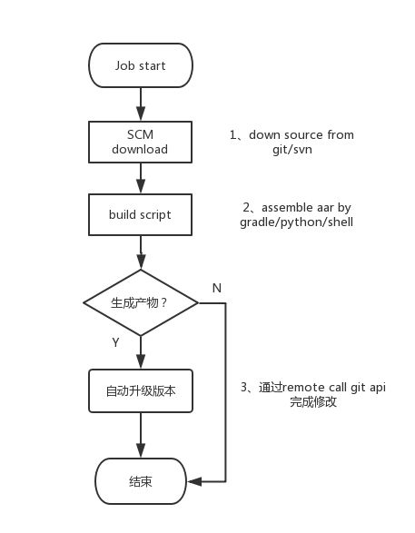
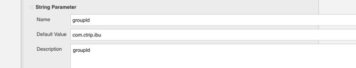
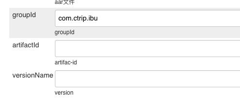
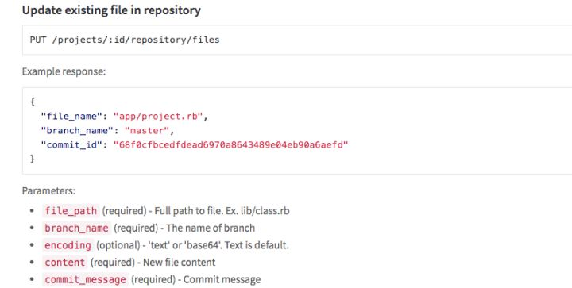
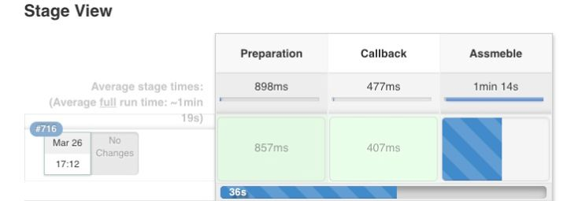

Android工程组件化之后业务和组件都比较独立。静态库升级以及集成打包工作会分散到不同职责所在的同学，模块发布测试流程涉及到的可能不止是开发的同学，也包括测试。本文介绍如何借助Jenkins工具和Django web平台完成自动化工程构建。

> 文章内容有限，更多是提供思路，涉及要有些技术细节不做细致描述。具体的可以回复或者私信沟通。

需要解决的问题列举如下：
- Library工程模块能够快速、便捷提供静态包。
- Bundle以及静态库版本的管理。
- 自动化的模块集成。
- 可视化的操作平台。

<br>
<br>
<h1>使用maven仓库管理静态</h1>

gradle支持静态的管理方式有多种方式。
<h2>方式一：Local本地管理</h2>

```java
repositories {
    flatDir {
        dirs 'libs'
    }
}
```

本地依赖可以在离线状态下工作，弊端就是静态库的目录需要跟随git去发布。固定版本的依赖还需要通知更新。

<h2>方式二:Maven仓库管理</h2>

```java
maven {
     url '***/repo/'
}
```

中央仓库通常可以download常用的各版本依赖库。google的某些库甚至需要翻墙，企业建议搭建自己的nexus仓库，用于管理自己的日常静态库发布。
nexus的搭建网上比较多不做详述。

那么Android该如何上传自己的静态库：

gradle官方有upload插件和详细的教程，这里贴上最佳实践：

```java
module build.gradle
apply plugin: 'maven'
uploadArchives {
   repositories.mavenDeployer {
           repository(url:"${project.ext.uploadRepo}") {
               /* nexus maven权限用户名密码 */
               authentication(userName: "", password: "")  
               pom.groupId = project.ext.groupId
               pom.artifactId = project.ext.artifactId
               pom.version = project.ext.versionName
           }
       }
}
```
配置上传的信息到module的build.gradle文件
```java
project.ext {
   groupId = "com.test" 
   versionName = "1.0.0"
   artifactId = "android-common"
}
```

进入项目根路径,module_name为需要发布静态库library module的名称,执行

```java
./gradlew :module_name:uploadArchives 
```

dependency依赖方式：


```java
compile 'com.ctrip:android-common:1.0.0@aar'
```


以上可以完成静态库发布/升级到maven仓库的流程。依赖的发布和升级管理管理已经方便了很多，不过只能开发在本地运行脚本来完成，版本号的更新依然需要通过修改build.gradle中的ext版本提交才行。发布的流程比较繁琐而且容易导致冲突。


以上，可以进一步的自动化。

<h1>Jenkins 持续集成</h1>

Jenkin专注ci，被广泛的应用在java和android的持续集成应用方面。Jenkins job的设计和丰富的plugin让我们可以不用过多繁杂的功能编码和部署。这里重点应用到其中Job（pipline/freestyle job）、Webhook、SCM（版本管理工具）的特性。

<h3>目标</h3>

非本地打包上传静态库,让jenkins自动完成打包、上传以及版本控制。

<h3>步骤</h3>



<h3>Job 类型</h3>

Jenkins支持多种类型的job，其中常用的是Freestyle project、maven project、pipline。freestyle可以定制程度比较高，默认集成了SCM工具，能够支持大多数常用的构建脚本语言。maven project 一般应用在maven构建的工程。pipline有比较直观的步骤和日志预览，较之于freestyle类型的job只能支持groovy的语法且不能直接在平台上预览workspace内容。android工程由gradle构建工具来负责打包，为了更直观的效果使用pipline也是可以满足需求的。

<h3>Download git source</h3>

需要构建的工程每次需要从git仓库拉取，再从本地workspace直接构建生成产物。选择freelinestyle job可以直接通过Source Code Management 选项配置下Git url 和branch。启动job的时候会自动根据配置下载工程代码到workspace。如果是pipline job类型，无法使用SCM，可以通过书写pipline script（groovy）来完成。

方式:

```java
node {
   stage('Preparation') { 
     /* ssh get build script repository，ssh-url填充你的git url */
     git url:'git@ssh-url',branch:'master'
   }
... 此处省略其他stage
}
```

<h3>构建</h3>

build-script里面包含了打包和上传的脚本。

编译/打包module核心：

```java
./gradlew clean assembleRelease 
```

<h3>上传</h3>

```java
./gradlew :module_name:uploadArchives
```

本人善用python，而且适用Linux/windows/macos任何平台。编译和上传的步骤这里假设包装到android_bundle_build.py文件里。这里建议把脚本也放到版本控制git repo或者工程仓库里面，同样通过SCM工具或者pipline script下载下来脚本所在的工程。接下来让jenkins job自动执行此脚本。pipline stage命名为"Build"嵌入到上个步骤的node阶段。

```java
stage('Preparation') { 
   /* download project source and build script source */
}
state('Build'){
   /* sh call build script*/
   sh 'python android_bundle_build.py  构建参数 '
}
```
实际上打包还是需要一些参数传入的，如上文project.ext节点的groupId、versionName 、artifactId的信息。jenkines脚本支持参数的传入配置并且直接在脚本中获取变量。

Project setting中勾选This project is parameterized选项，添加对应所需类型的参数，如下：



此时start job时候点击Build with Parameters就可以看到一个可填入内容的网页，填入后又jenkins传入job刚才设置的变量中：



<h3>变量的使用</h3>

获取变量后传入到打包脚本，供打包脚本使用：

```java
sh 'python android_bundle_build.py  -groupId $groupId -artifactId $artifactId -version $version'
```

<b>$变量名 即可获得页面填写的变量值（groovy 语法）。</b>

<h3>版本升级</h3>

完成了自动发布和升级静态库，实际上其他的开发的同学还是获取不到最新的依赖版本。
build.gradle中的依赖版本

```java
/* 此处的version还是没有得到更新的*/
compile 'com.test@1.0.0@aar'
```

<b>解决方案</b>

提取gradle的依赖到配置文件version_config.xml

```java
<?xml version='1.0' encoding='utf8'?>
<Module-list>
    <Module>
        <name>CommonModule</name>
            <groupId>com.test</groupId>
            <artifactId>android-common</artifactId>
            <versionName>1.0.0</versionName>
    </Module>
</Module-list>
```

gradle解析version.config。解析文件：parse_version.gradle

```java
def parseXml() {
  def modules = new XmlParser().parse(rootDir.getAbsolutePath() + "/config/version_config.xml");
  modules.Module.each {
  def moduleName = it.name.text();
  def moduleGroupId = it.groupId.text();
  def moduleArtifactId = it.artifactId.text();
  def moduleVersionName = it.versionName.text();

  java.lang.StringBuffer str = new StringBuffer();
       str.append(moduleGroupId).append(":").append(moduleArtifactId).append(":")
                                       .append(moduleVersionName).append("@aar");
for (reference in rootProject.ext) {
           reference.set(moduleName, str.toString());
break;
       }
   }
}
```

最外层build.gradle中apply parse_version.gradle：

```
apply from: rootDir.getAbsolutePath() + "/script/parse_version.gradle"
```

此时的依赖方式更改为：
```java
/* 此处的version从version_config中获取 */
compile rootProject.CommonModule 
```
CommonModule即为version_config.xml中定义的name节点。

到这里只差一步，那就是<b>jenkins打包上传之后自动升级version_config中的versionName</b>。

为了让大家都能得到更新，可以在job完成的时候通过git api直接修改并提交version_config中的versionName。

同样可以使用python来完成。python有成熟的git/gitlab/svn工具包。这里推荐几个：

[python-gitlab/python-gitlab](http://link.zhihu.com/?target=https%3A//github.com/python-gitlab/python-gitlab)

[GitPython Tutorial](http://link.zhihu.com/?target=http%3A//gitpython.readthedocs.io/en/stable/tutorial.html)

对应具体的git/gitlab 修改文件api

如gitlab v3 api：



完成modify_version_config.py的功能之后，同理去state节点去执行自动的任务。

至此。自动打包升级的功能就完成了，jenkines有简易的操作界面。可以去可视化的一键打包啦：



进入对应job视图，点击 Build With Parameter按钮，填入必须参数。启动！


似乎蛮简陋的。自己或者小规模团队用用还可以。做更好的产品，还是需要更进一步的完成.