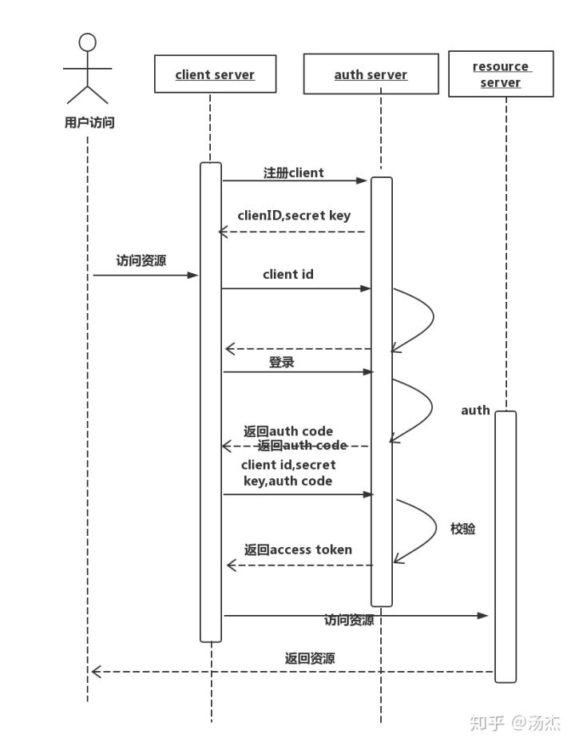

在设计一个系统的时候大多数都需要一个登陆授权的方案来保证访问安全和权限的控制。好在我们有类似于spring这样的框架，更多的时候只需要完成几行配置就能工作。这也让开发者忽略了他的工作流程和原理,就通过这篇文章来认识探讨下。首先抛出一个概念：SSO单点登录（Single Sign On）。

<h1>SSO&CAS</h1>
其定义为：

>SSO是在多个应用系统中，用户只需要登录一次就可以访问所有相互信任的应用系统。它包括可以将这次主要的登录映射到其他应用中用于同一个用户的登录的机制。它是目前比较流行的企业业务整合的解决方案之一。

SSO这是一个概念方案，其中有我们经常听到的著名的耶鲁大学的CAS系统就是它的一个实现。具体可以了解 [CAS Architecture](https://link.zhihu.com/?target=https%3A//apereo.github.io/cas/4.2.x/planning/Architecture.html)，其工程流程图如下：

其中核心要解决的的是引入鉴权和认证的流程，实现多套系统的单一访问需要的是同一套授权方案即可。

<h1>鉴权和认证</h1>

认证(Authentication)和授权（Authorization）总是成对出现，但是不能混为一谈。

简单的来说，认证是用来确定小明是不是真的小明的。授权是限定小明具备哪些权限的，比如小明只可以看这篇博客不能修改这篇博客，而我作者本人可以。

那么这个流程应该是怎么样的呢，每家的方案不能总不一样吧，那么就出现了这样一个标准:OAuth,现在已经出到2.0了，也就是我们今天要了解的OAuth 2.0.所以

> OAuth2.0是行业标准的授权(Authentication)协议.

OAuth 2.0关注客户端开发者的简易性，同时为Web应用，桌面应用和手机，和起居室设备提供专门的认证流程

来看官方的工作流描述：

Abstract Protocol Flow，好吧，是挺抽象，尤其是Autorization Grant是怎么完成的我们还是不得而知。不过我们可以得知<b>想要访问资源服务，我们最终是拿到授权服务分配的Access Token</b>，OAuth 2.0的授权模式有好几种，主要还是根据设计的需求。我们就拿最复杂和最完善的一个模式来分析：授权码模式。同样，我们先看官方的解释：

从图中我们可以看出大概的流程，用户访问资源的时候首先要经过授权服务的授权，访问授权服务的过程用户通过客户代理带上注册好的Clent ID 和重定向的地址，授权服务验证好是否正确之后会给到客户代理一个授权码，把授权码带给客户端，客户端可以通过此授权码才能获取可访问的Access Token。前面有总结过，只有拿到有效的Access Token才能畅通的访问到我们的资源服务。

 不过...为什么要这么复杂？为什么不一步到位第一次访授权服务的时候（User authenticates）就拿到Access Token,而需要通过授权码去拿到Access Token？

答案是：为了安全

首先这里需要此类授权码的情况只成立于是并没有使用Https去访问，比我类似于穷x的博主买不起ssl认证服务。因为问题可能出现在给到client端Access Token的方式有关，如果直接借助的重定向返回AccessToken,这就给了Hacker劫持到Access Token的机会，因为uri可能通过HTTP referrer被传递给其它恶意站点，也可能存在于浏览器cacher或log文件中。但是直接重定向返回Authorization Code就不是什么敏感的数据了，通过Authorization Code再重新校验去获取Access Token的时候需要上传Client密钥（仅client持有），拥有有效Client Secret 的访问才能被保证是安全的。

> 如果你不是类似于博主这样的穷x,官方推荐也是implicit flow模式，更加快捷安全。

以上，基本上清楚了OAuth2的流程，恰巧勤劳的大神么也会有些不错的实现代码供大家参考，这里搜罗了一个不错的实现案例：[oltu-oauth2-example](https://link.zhihu.com/?target=https%3A//github.com/ameizi/oltu-oauth2-example)

结合的画一个流程图帮助理解：

重要流程列表

- 注册应用：获取client_id，client_secret。
- 请求授权码：通过client_id获取授权码auth_code
- 换取accessToken：通过client_id，client_secret，auth_code获取AccessToken
- 通过AccessToken访问资源服务
- 其中请求授权的过程需要打开登陆页面，输入用户名密码正确之后再返回auth_code。

